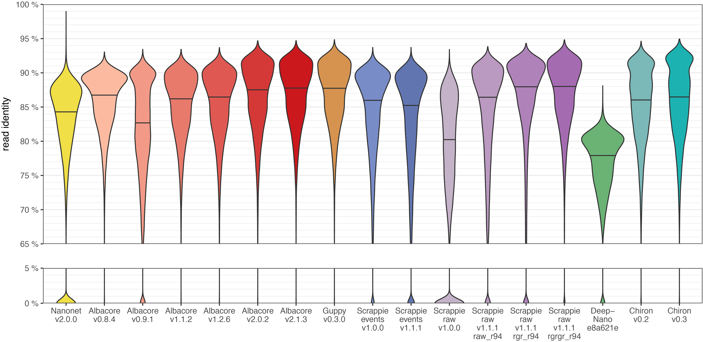
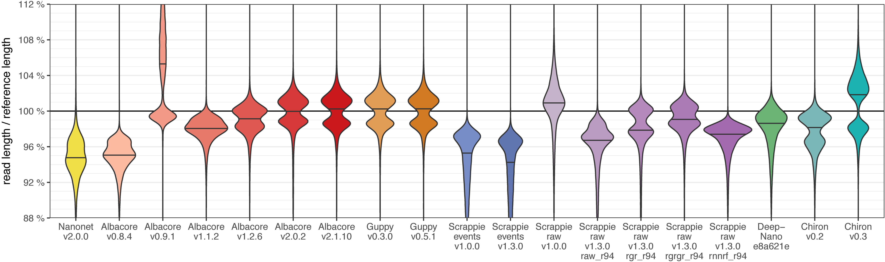
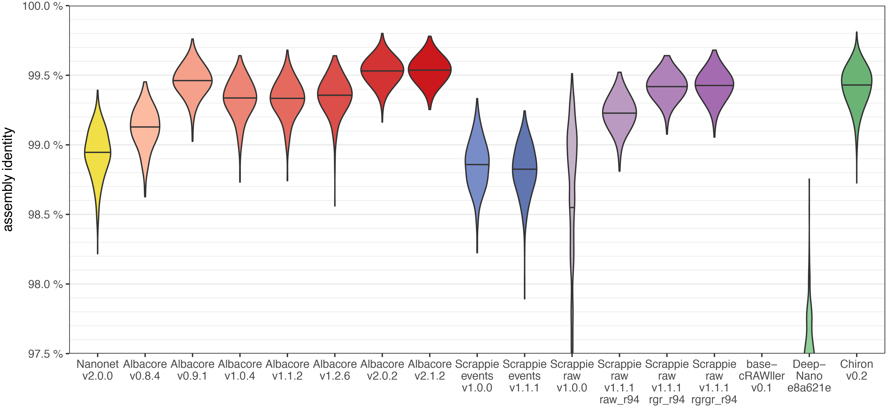
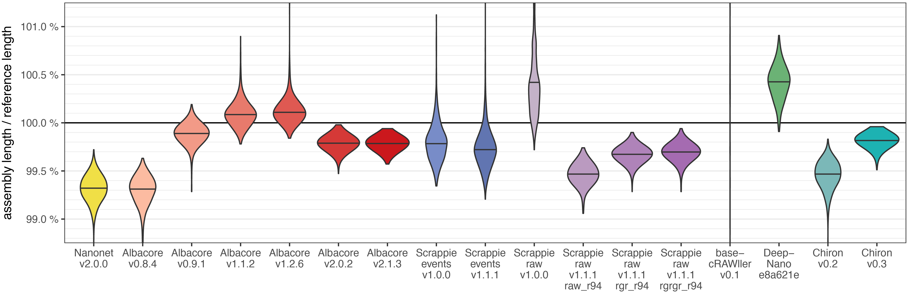
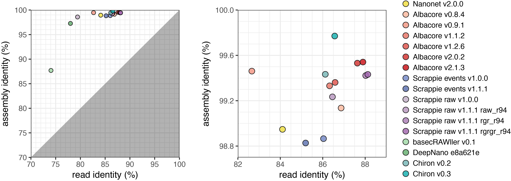
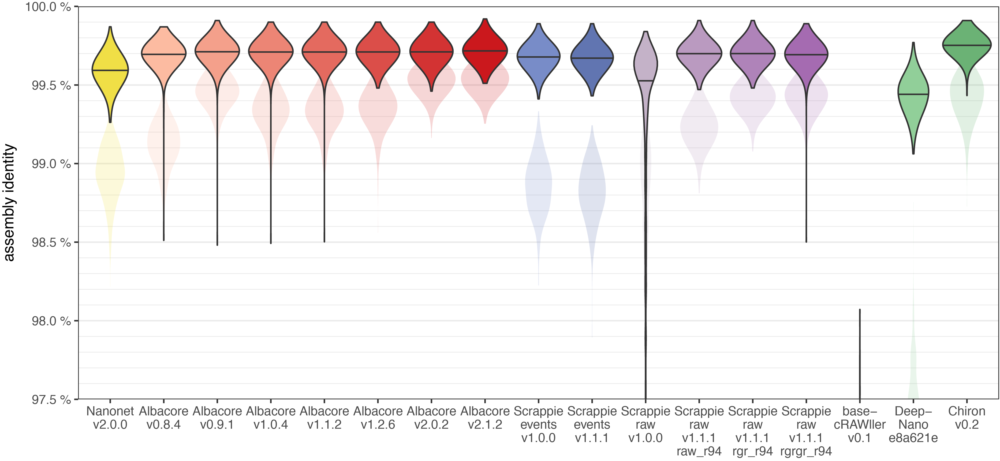
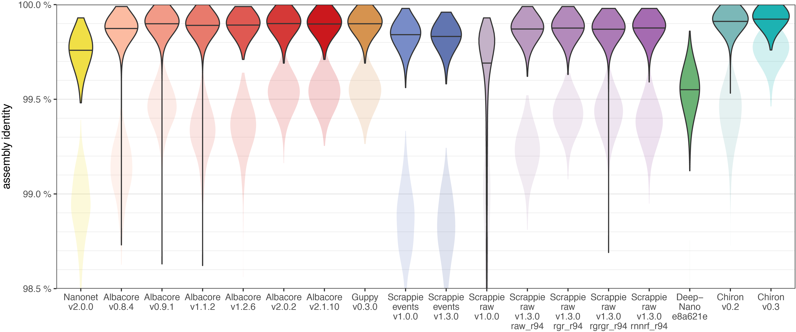
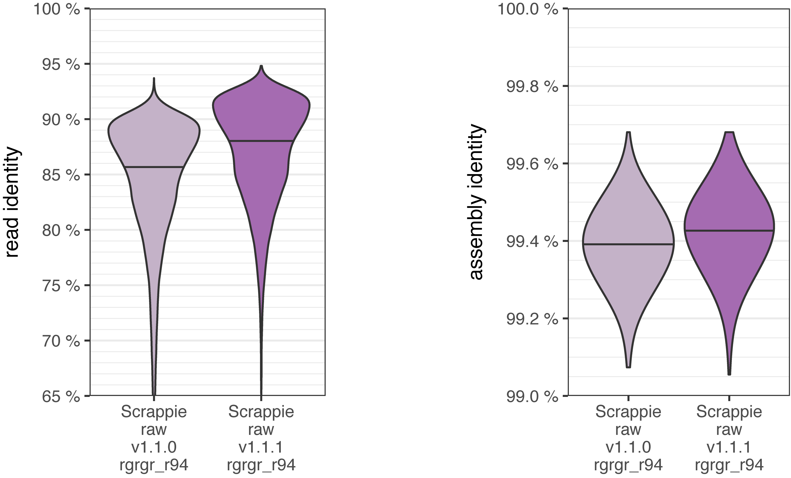

# Comparison of Oxford Nanopore basecalling tools

__Ryan R. Wick, Louise M. Judd and Kathryn E. Holt__
<br>
<sub>Department of Biochemistry and Molecular Biology, Bio21 Molecular Science and Biotechnology Institute, University of Melbourne, Australia</sub>


<p align="center"></p>


## Abstract

This repository uses a bacterial genome to assess the read accuracy and consensus sequence accuracy for Oxford Nanopore Technologies (ONT) basecallers. Albacore v2.1.1 and Scrappie raw v1.1.1 (both developed by ONT) were the best overall performers, and Chiron v0.2 was the best performing third-party basecaller. Consensus sequence accuracies reached approximately 99.5%, revealing that even the best basecallers still have systematic errors. Nanopolish, used with its methylation-aware option, was able to raise consensus accuracy to about 99.9%.


## Table of contents

* [Intro](#intro)
* [Basecallers tested](#basecallers-tested)
* [Method](#method)
* [Results/discussion](#resultsdiscussion)
  * [Total yield](#total-yield)
  * [Read identity](#read-identity)
  * [Relative read length](#relative-read-length)
  * [Assembly identity](#assembly-identity)
  * [Read vs assembly identity](#read-vs-assembly-identity)
  * [Nanopolish assembly identity](#nanopolish-assembly-identity)
  * [Methylation](#methylation)
  * [Training sets](#training-sets)
  * [Combining different basecallers](#combining-different-basecallers)
* [Conclusions](#conclusions)
* [References](#references)


## Intro

This repository contains a comparison of available basecallers for Oxford Nanopore Technologies (ONT) sequencing reads. It's a bit like a paper, but I decided to put it here on GitHub (instead of somewhere more papery like [bioRxiv](http://www.biorxiv.org/)) so I can come back and update it as new versions of basecallers are released.

Basecallers are programs which translate the raw electrical signal from an ONT sequencer to a DNA sequence. Basecalling is interesting because it's a hard machine learning problem (modern basecallers all seem to tackle it with neural networks) and because it's a huge part of what makes ONT sequencing good or bad. Getting a piece of DNA through a pore and measuring the current is only half the battle; the other half is in the computer. It's a very active field, with both ONT and independent researchers developing methods.

For each basecaller, I assessed the accuracy of the reads and of the resulting assembly. Read accuracy is interesting for obvious reasons – more accurate reads are nice! Assembly accuracy is interesting because shows whether the read errors can 'average out' with high sequencing depth. This provides a window into the nature of the basecalling errors. For example, consider a hypothetical set of reads with a mediocre accuracy of 80% but a truly random error profile. Despite their error rate, these reads could result in a perfect assembly. Now consider a set of reads with an excellent 98% accuracy but they all make the _same mistakes_ (i.e. error is systematic, not random) – their assembly will have an accuracy of 98%, no better than the raw reads and worse than our first hypothetical assembly. Which read set is better? That probably depends on how you're using them, but in my line of work, I'd prefer the first.

I hope these results help to answer the question: _Should I go back to old reads and re-basecall them with a newer basecaller?_ Doing so could take a lot of CPU time, so you probably don't want to do it unless it would bring a significant improvement.

I used a 1D R9.4 dataset of native DNA _Klebsiella pneumoniae_ reads for this analysis, so my results may be biased toward that kind of data. I'm not sure how consistent these results are with other data types, e.g. eukaryote genomes, R9.5 flow cells, 1D<sup>2</sup> kits, PCRed DNA, etc.


## Basecallers tested

For each basecaller I have only used the training model(s) included with the program. Custom training of the neural net is out of scope for this analysis. Similarly, whenever low-level tuning parameters were available, I used the defaults.

When a basecaller had many versions, I skipped superseded patch versions. E.g. I tested Albacore v1.1.2 but not v1.1.0 and v1.1.1.


### Nanonet

[Nanonet](https://github.com/nanoporetech/nanonet) is ONT's first generation neural network basecaller. I used the [latest commit](https://github.com/nanoporetech/nanonet/commit/a5a832bb3c82fbde091554142fab491d4bec2664) (at the time of writing) on the master branch. This seems to be functionally identical to v2.0.0, so that's what I've called it. Nanonet no longer appears to be under active development, so this may be the final version.

```
nanonetcall --chemistry r9.4 --write_events --min_len 1 --max_len 1000000 --jobs 40 raw_fast5_dir > /dev/null
```
I set the `--min_len` and `--max_len` options so Nanonet wouldn't skip any reads. While Nanonet outputs its basecalls to stdout in fasta format, I've discarded that and instead used the `--write_events` option so it stores fastq basecalls in the fast5 files, which I can extract later. Unlike Albacore, which makes a copy of fast5 files, Nanonet modifies the original ones in the `raw_fast5_dir` directory.


### Albacore

Albacore is ONT's official command-line basecaller. I tested versions 0.8.4, 0.9.1, 1.0.4, 1.1.2, 1.2.6, 2.0.2 and 2.1.1. These were all released in 2017, which shows the rapid pace of basecaller development. The transducer basecaller (helps with homopolymers) was added in v1.0. Basecalling from raw signal (without segmenting the signal into events) first appears in v2.0. Albacore can be downloaded from the [Nanopore community](https://community.nanoporetech.com/downloads), but you'll need an account to log in.

```
# Albacore v0.8.4 and v0.9.1:
read_fast5_basecaller.py -c FLO-MIN106_LSK108_linear.cfg -i raw_fast5_dir -t 40 -s output_dir

# Albacore v1.0.4:
read_fast5_basecaller.py -f FLO-MIN106 -k SQK-LSK108 -i raw_fast5_dir -t 40 -s output_dir

# Albacore v1.1.2 and v1.2.6:
read_fast5_basecaller.py -f FLO-MIN106 -k SQK-LSK108 -i raw_fast5_dir -t 40 -s output_dir -o fast5

# Albacore v2.0.2 and v2.1.1:
read_fast5_basecaller.py -f FLO-MIN106 -k SQK-LSK108 -i raw_fast5_dir -t 40 -s output_dir -o fast5 --disable_filtering
```

Albacore v1.1 and later can basecall directly to fastq file with `-o fastq`. This saves disk space and is usually more convenient ([especially since Nanopolish v0.8](http://simpsonlab.github.io/2017/09/06/nanopolish-v0.8.0/)), but for this experiment I used `-o fast5` to keep my analysis options open.


### Scrappie

[Scrappie](https://github.com/nanoporetech/scrappie) is ONT's research basecaller. Successful developments here seem to eventually work their way into Albacore. I tested versions 1.0.0 and 1.1.1.

Scrappie can be run as `scrappie events` (basecalls from event segmentation) or as `scrappie raw` (basecalls directly from the raw signal). For Scrappie v1.0.0, running as `scrappie events` relies on pre-existing event data in the fast5s, so I used the fast5s produced by Albacore 1.2.6 (the last version to do event segmentation). In Scrappie v1.1.1, there are three different raw basecalling models to choose from (raw_r94, rgr_r94 and rgrgr_r94) and I tried each. As a side note, the rgr_r94 and rgrgr_r94 models are referred to as 'pirate' models, for reasons explained [here](https://github.com/rrwick/Basecalling-comparison/issues/1#issuecomment-330766633).


```
# Scrappie v1.0.0:
scrappie events --albacore --threads 40 albacore_v1.2.6_fast5 > scrappie_v1.0.0_events.fasta
scrappie raw --threads 40 raw_fast5_dir > scrappie_v1.0.0_raw.fasta

# Scrappie v1.1.1:
scrappie events --threads 40 raw_fast5_dir > scrappie_v1.1.1_events.fasta
scrappie raw --model raw_r94 --threads 40 raw_fast5_dir > scrappie_v1.1.1_raw_raw_r94.fasta
scrappie raw --model rgr_r94 --threads 40 raw_fast5_dir > scrappie_v1.1.1_raw_rgr_r94.fasta
scrappie raw --model rgrgr_r94 --threads 40 raw_fast5_dir > scrappie_v1.1.1_raw_rgrgr_r94.fasta
```

Unlike Albacore, Scrappie does not have fastq output, either directly or by writing it into the fast5 files – it only produces fasta reads.


### basecRAWller

[basecRAWller](https://basecrawller.lbl.gov/) is a third-party basecaller developed by [Marcus Stoiber and James Brown](http://brownlab.lbl.gov/) at the Lawrence Berkeley National Laboratory. I tested v0.1 (the only version).

```
basecRAWller call --fast5-basedirs raw_fast5_dir --out-filename basecrawller_v0.1.fasta
```

Unlike other basecallers, it focuses on _streaming_ basecalling. I.e. it can basecall data using any part of a read and does not require the entire sequence to be present. This could potentially be used to basecall reads even before they are finished sequencing. However, as discussed in the [basecRAWller paper](https://www.biorxiv.org/content/early/2017/05/01/133058), the ability to perform streaming basecalling negatively impacts accuracy.


### Chiron

[Chiron](https://github.com/haotianteng/chiron) is a third-party basecaller developed by [Haotian Teng](https://github.com/haotianteng) and others in [Lachlan Coin's group](https://imb.uq.edu.au/profile/647/lachlan-coin) at the University of Queensland and described in [this paper](https://www.biorxiv.org/content/early/2017/09/12/179531). Versions 0.1 and 0.1.4 had some bugs which caused issues with my data, so I only tested v0.2.

```
chiron call -i raw_fast5_dir -o chiron_v0.2 --batch_size 1000
```

While testing Chiron, I noticed a curious effect. The `--batch_size` parameter was described as controlling performance: a larger value runs faster but increases RAM requirements. While I found this to be true, I also saw another effect: larger `--batch_size` values improved the read accuracy. The default is 100 and I saw modest read accuracy improvements up to about 500, after which accuracy plateaued. I used `--batch_size 1000` to improve both performance and accuracy.


### DeepNano

[DeepNano](https://bitbucket.org/vboza/deepnano) is developed by Vladimír Boža and colleagues at Comenius University and is described in [this paper](http://journals.plos.org/plosone/article?id=10.1371/journal.pone.0178751). I could not find version numbers associated with DeepNano, so I used the current commit (at the time of this writing): [e8a621e](https://bitbucket.org/vboza/deepnano/commits/e8a621e17b9fb73c261e6ca041976440812bc75f).

```
export OMP_NUM_THREADS=1
python basecall.py --chemistry r9.4 --event-detect --max-events 1000000 --directory raw_fast5_dir --output deepnano.fasta
```

The `--max-events` parameter is important – without it DeepNano will use a default of 50000 which results in a maximum read length of about 30 kbp (longer reads are truncated). It's also worth noting that the basecalling script I ran was _not_ the `basecall.py` in the DeepNano base directory, but rather the `basecall.py` in the `r9` directory, which can handle R9.4 reads.


### Excluded basecallers

I am interested in [Guppy](https://github.com/nanoporetech/guppy), a GPU-accelerated ONT basecaller. However, it is only available to users who have signed the ONT developer license agreement (which is why you might get a 404 if you try that link). If and when Guppy becomes publicly available, I'll add it to this comparison too.

Unfortunately, I cannot compare with the old cloud-based [Metrichor](https://metrichor.com) basecalling, as it's no longer available. I also cannot test the integrated basecalling in MinKNOW (ONT's sequencing software). I believe MinKNOW's integrated basecalling shares much in common with Albacore, but I don't know which Albacore versions correspond to which MinKNOW versions.


## Method

If you'd like to try this analysis for yourself, here's what you need to do. I tried to make this process reproducible, but some aspects may be specific to my setup, so you may need to modify parts to make it work for you. In particular, the [`nanopolish_slurm_wrapper.py`](nanopolish_slurm_wrapper.py) script assumes you're using a SLURM-managed cluster, so other users will probably need to change that one.


### Required files

You'll obviously need a set of ONT reads. Put them in a directory named `01_raw_fast5`. I used the same ones from our recent paper: [Completing bacterial genome assemblies with multiplex MinION
sequencing](http://mgen.microbiologyresearch.org/content/journal/mgen/10.1099/mgen.0.000132) (and [its corresponding repo](https://github.com/rrwick/Bacterial-genome-assemblies-with-multiplex-MinION-sequencing)). Check out that paper if you're interested in the wet lab side of things.

You'll also need Illumina reads for the sample (named `illumina_1.fastq.gz` and `illumina_2.fastq.gz`) and a good reference sequence (named `reference.fasta`), e.g. a completed hybrid assembly. For the reference-based assembly step later, it's important that circular replicons in `reference.fasta` have `circular=true` in their FASTA header.

My reads came from a barcoded run, so I first had to collect only the fast5 files for my sample. I did this by analysing the fastq file of our confidently-binned reads (see [the paper](http://mgen.microbiologyresearch.org/content/journal/mgen/10.1099/mgen.0.000132) for more info). This process should have excluded most of the very low-quality reads, because such reads would not have been confidently binned. I also discarded any fast5 files less than 100 kilobytes in size to remove shorter reads.

If you'd like to try this analysis using the same data I used, here are the relevant links:
* [Reference hybrid assembly](https://figshare.com/articles/Unicycler_v0_4_0_assemblies_hybrid_Illumina_and_ONT_/5170750) (`barcode01.fasta.gz`)
* [Illumina reads](https://figshare.com/articles/Trimmed_Illumina_reads/5170831) (`barcode01_1.fastq.gz` and `barcode01_2.fastq.gz`)
* [Raw fast5 files](https://figshare.com/articles/Raw_ONT_reads_-_barcode_1/5353210)


### Required tools

The following tools must be installed and available in your `PATH`:<br>
[minimap2](https://github.com/lh3/minimap2) v2.2, [Filtlong](https://github.com/rrwick/Filtlong) v0.1.1, [Porechop](https://github.com/rrwick/Porechop) v0.2.2, [Racon](https://github.com/isovic/racon) v0.5.0, [Rebaler](https://github.com/rrwick/Rebaler) v0.1.0, [Nanopolish](https://github.com/jts/nanopolish) v0.8.4 and [SAMtools](https://samtools.github.io/) v1.3.1.

I've indicated the versions I used, but the exact versions may or may not be important (I haven't checked). However, it is necessary to use a recent version of Nanopolish. Since v0.8, Nanopolish can be run without event-data-containing fast5 files, which lets it work with any basecaller! However, for non-Albacore basecallers I did have to alter read names – more on that later.


### Basecalling

The commands I used are described above in the [Basecallers tested](#basecallers-tested) section. Regardless of which basecaller was used, the reads need to be put in a `02_basecalled_reads` directory in either `*.fastq.gz` or `*.fasta.gz` format.


### Read ID to fast5 file

It is also necessary to make a `read_id_to_fast5` file which contains two columns: read ID in the first and fast5 filename in the second. For example:
```
0000974e-e5b3-4fc2-8fa5-af721637e66c_Basecall_1D_template	5210_N125509_20170425_FN2002039725_MN19691_sequencing_run_klebs_033_restart_87298_ch173_read25236_strand.fast5
00019174-2937-4e85-b104-0e524d8a7ba7_Basecall_1D_template	5210_N125509_20170424_FN2002039725_MN19691_sequencing_run_klebs_033_75349_ch85_read2360_strand.fast5
000196f6-6041-49a5-9724-77e9d117edbe_Basecall_1D_template	5210_N125509_20170425_FN2002039725_MN19691_sequencing_run_klebs_033_restart_87298_ch200_read1975_strand.fast5
```

This will be used by the [`fix_read_names.py`](fix_read_names.py) script to ensure that all basecalled reads are named consistently and compatible with Nanopolish.


### Run analysis

The [`analysis.sh`](analysis.sh) script automates most of the remaining steps. It will:
1) Change the read names to a consistent, Nanopolish-friendly format ([`fix_read_names.py`](fix_read_names.py)).
2) Align the reads to a reference and make a tsv file of read accuracies ([`read_length_identity.py`](read_length_identity.py)). This only uses the aligned parts of the read to calculate the read's identity. The definition of 'identity' is the same as how BLAST defines it: the number of matches in the alignment divided by the total bases in the alignment (including gaps). If less than 50% of a read aligned, it is deemed unaligned and given an identity of 0%. This script also determines the read length to reference length ratio for each read, to see if insertions or deletions are more likely.
3) Prepare reads for assembly (`porechop` and `filtlong`).
4) Do a reference-based assembly (`rebaler`).  [Rebaler](https://github.com/rrwick/Rebaler) conducts multiple rounds of [Racon](https://github.com/isovic/racon), so the final assembly accuracy is defined by the Racon consensus (which in my experience is a bit higher accuracy than a [Canu](https://github.com/marbl/canu) assembly).
5) Assess the assembly accuracy. By chopping the assembly into 10 kbp pieces ([`chop_up_assembly.py`](chop_up_assembly.py)) and treating them like reads ([`read_length_identity.py`](read_length_identity.py)), we can get a _distribution_ of assembly identity instead of just a single value.
6) Run Nanopolish ([`nanopolish_slurm_wrapper.py`](nanopolish_slurm_wrapper.py)).
7) Assess the Nanopolished assembly ([`chop_up_assembly.py`](chop_up_assembly.py) and [`read_length_identity.py`](read_length_identity.py)).


### Generate figures

Put all your resulting tsv files in a `results` directory and run [`plot_results.R`](plot_results.R) to generate figures. Edit the `basecaller_names` and `basecaller_colours` vectors at the top of that script to control which results are included in the plots.


## Results/discussion

### Total yield

<p align="center"></p>

You might expect that each basecaller would produce approximately the same total yield. E.g. a read that makes a 10 kbp sequence in one basecaller would be about 10 kbp in each basecaller. That's mostly true, but Nanonet is a notable exception. For most reads, it produced a much shorter sequence than other basecallers, sometimes drastically so. For example, all versions of Albacore basecalled one read (d2e65643) to a 34+ kbp sequence. Nanonet produced 518 bp for the same read. I don't have an explanation for this odd behaviour.

Other oddities you might notice are Albacore v0.9.1 and basecRAWller, which produced more sequence than the others, and Scrappie events, which produced less. These are explained in the [Relative read length](#relative-read-length) section.


### Read identity

<p align="center"></p>

This addresses the most obvious question: how accurate are the basecalled reads? The plot above shows read identity distributions, with the medians (weighted by read length) marked as a horizontal line. Unaligned reads were given an identity of 0% and fall to the bottom of the distribution. Reads with an actual identity below 65% often fail to align and end up at 0%.

Nanonet performed poorly, with a low median and a significant proportion of unaligned reads. Its curiously high peak of about 99% results from the short output sequences discussed above. While a few Nanonet 'reads' did indeed align to the reference with up to 99% identity, these were actually just small fragments (hundreds of bp) of larger reads.

Albacore and Scrappie performed the best overall, with Albacore v0.9.1 and Scrappie raw v1.0.0 being interesting exceptions. Albacore v2.1.1 and Scrappie raw v1.1.1 (with the rgr_r94 and rgrgr_r94 models) were the best performing of all tested basecallers. Interestingly, Scrappie tended to produce more unaligned reads than Albacore – I'm not sure why.

BasecRAWller performed the worst, producing reads with so much error as to be nearly unusable. I have a hypothesis as to why this is the case: the models included with basecRAWller were trained only on human reads. Figure 2 in the [basecRAWller paper](https://www.biorxiv.org/content/early/2017/05/01/133058) shows that _E. coli_ reads basecalled using a human-data-trained model give read identities in the mid 70s – similar to my results. If my hypothesis is correct, then basecRAWller has the potential to perform much better if it had a model more appropriate to my sample.

DeepNano also performed quite poorly with most reads under 80% identity. Chiron did reasonably well, producing reads comparable to Albacore/Scrappie.


### Relative read length

<p align="center"></p>

This plot shows the distribution of read length to reference length for each alignment. It shows whether the basecaller is more prone to insertions or deletions. 100% (same length) means that insertions and deletions are equally likely. <100% means that deletions are more common than insertions. >100% means that insertions are more common than deletions. Albacore v0.9.1 and basecRAWller stand out with many overly-long reads, while Scrappie events tends to make short reads. This explains the total yield differences we saw earlier.

I found it curious that many basecallers had a distinctly bimodal distribution. I dug a bit deeper and found that it's related to the timing of this MinION run. The run was started at about 4 pm and MinKNOW crashed at 10:30 pm, halting the run. Nobody was in the lab to notice, and the next day was a [public holiday](https://www.awm.gov.au/commemoration/anzac-day/traditions). Thankfully Louise came in that afternoon, saw the crashed run and restarted it at about 3 pm. That means the flow cell sat for about 16.5 hours not being used. When I [plot read length against signal length and colour by the restart](images/read_vs_signal_albacore_v2.1.1.png), the effect is obvious. It's still not entirely clear _why_ the restart has resulted in shorter basecalled reads, but the effect is present in all basecallers. A possible clue is that the raw signal values are lower after the restart: with a median value of about 450 before and 370 after.


### Assembly identity

<p align="center"></p>

This analysis is my personal favourite: how accurate are the _consensus_ sequences? I don't particularly care if individual reads have low identity if they can produce an accurate assembly.

Albacore v2.1.1 leads the pack with an accuracy of over 99.5% (less than one error per 200 bases). Most surprisingly, Albacore v0.9.1, which had very poor read identity, also did well. Scrappie raw v1.0.0, basecRAWller and DeepNano all performed poorly (basecRAWller isn't missing from this plot, it's off the bottom with a median value in the 80s).

It's also interesting to look at the assembly relative length, like we did for reads:

<p align="center"></p>

This shows which basecallers are more prone to consensus sequence insertions (e.g. Albacore v1, Scrappie raw v1.0.0 and DeepNano) and which are more prone to deletions (most of the rest). BasecRAWller looks like a line in this plot because the bulk of its distribution is between 107% and 108% but it extends down to 77%.


### Read vs assembly identity

<p align="center"></p>

Here I've plotted the median read identity and median assembly identity for all basecallers – zoomed out on the left, zoomed in on the right. The shaded zone is where assembly identity is _worse_ than read identity. That should be impossible (unless you've got a _very_ bad assembler).

This shows how much of each basecaller's error is random vs systematic. If a basecaller had the same read and assembly identities (i.e. on the edge of the shaded zone), that would imply that _all_ its error is systematic and every read is making the same mistakes. Thankfully, assembly identities are nowhere near that low. Conversely, if a basecaller had an assembly identity of 100%, that would imply a there was little systematic error so all problems could be fixed in the consensus.

You might expect that a basecaller's read and assembly identities would be tightly correlated: low-identity reads produce low-identity assemblies and vice versa. That is mostly the case, with Albacore v0.9.1 being the strongest outlier. This suggests that while Albacore v0.9.1 produces reads with a large amount of total error, they have comparatively low systematic error. 


### Nanopolish assembly identity

I ran Nanopolish with two different configurations, with and without the `--methylation-aware dcm,dam` option that was added in v0.8.4.

First, here are the results _without_ that option. The plot shows the assembly identity distributions after Nanopolish, with pre-Nanopolish distributions lightly drawn underneath:

<p align="center"></p>

In every case, Nanopolish improved the assembly accuracy, and most post-Nanopolish assemblies are quite similar to each other and near 99.7% accurate. In a few cases, Nanopolish resulted in a ~100 bp insertion, which caused the distribution to extend down to 98.5%. I'm not sure if this is an issue with Nanopolish (the insertion was erroneous) or with the reference sequence (the insertion was correct). Four of the 16 assemblies did not reach the 99.7% accuracy of the others. Nanonet's truncated reads may have caused problems for Nanopolish. Scrappie raw v1.0.0, basecRAWller and DeepNano probably suffered due to their low accuracy pre-Nanopolish assemblies.

The upside seems to be that if you're planning to use Nanopolish, then your basecaller choice may not be very important. Any basecaller, as long as it isn't awful, should be fine. The downside is that Nanopolish makes a relatively small improvement to an already good assembly.

Now here are the results _with_ the methylation-aware option:

<p align="center"></p>

The improvement is huge! Most assemblies now reach about 99.9% accuracy. Most of the remaining errors are in homopolymers:

```
assembly:   AACCGCTACCACTCATCTTCCCCCGCCTCGCGGG-GA-TTTTTTGCTTG
reference:  AACCGCTACCACTCATCTTCCCCCGCCTCGCGGGGGATTTTTTTGCTTG
                                              ^  ^           
```


### Methylation

The Nanopolish results show that, at least for this dataset, methylation is a major factor in consensus accuracy. For example, when a pre-Nanopolish assembly is aligned to the reference, many of the errors correspond to the Dcm motif (`CCAGG` / `CCTGG`):
```
assembly:   CCCGG   CCCGGG   CCGGG   CC-GG   CC-GG   CCA-G   CACGG   CCCGGG
reference:  CCTGG   C-CAGG   CCAGG   CCAGG   CCTGG   CCAGG   CCTGG   C-CTGG
              ^      ^ ^       ^       ^       ^       ^      ^^      ^ ^  
```

While Nanopolish can correct many of these errors, it would be better if the basecallers themselves could properly recognise modified bases. While calling modified bases _as modified bases_ would be fascinating and useful, a first step would be to call modified bases as their canonical base. E.g. 5-mC called as a C, 4-mC as a C, 6-mA as an A, etc. This could be a tricky problem, as different organisms have different enzymes which modify bases at different sequence motifs. Perhaps basecallers need very broad training sets which include as many such motifs as possible. Or perhaps each basecaller needs multiple trained models, each on different organisms, and an automatic method for choosing the appropriate one.


### Training sets

All supervised learning depends on a good training set, and basecalling is no exception. A nice example comes from the rgrgr_r94 model in Scrappie v1.1.0 and v1.1.1. The primary difference between these two versions is that in v1.1.0, only human DNA was used to train the basecaller, whereas v1.1.1 was trained with a mixed set of genomes ([described here](https://github.com/rrwick/Basecalling-comparison/issues/1) by Scrappie author Tim Massingham). I didn't include v1.1.0 in the above plots because it's a superseded version – it's here only to show the difference a training set makes. The difference in read identity is huge, but assembly identity had a subtler improvement:

<p align="center"></p>


### Combining different basecallers

While each basecaller suffers from systematic error, the exact nature of the systematic error may differ between basecallers. If this is true, could a combination of reads from two independent basecallers result in a better consensus sequence? Based on [Clive Brown's suggestion](https://twitter.com/Clive_G_Brown/status/908256098624446464), I tried this with Albacore v2.1.1 (the best performing ONT basecaller) and Chiron v0.2 (the best performing third-party basecaller), and the combination indeed gave a considerably improved pre-Nanopolish assembly:

<p align="center"></p>

Running Nanopolish brings all of the assemblies up to an equivalent level, so this experiment is somewhat academic. I.e. anybody interested in maximising assembly accuracy should just run Nanopolish, not waste time combining reads from separate basecallers.


## Conclusions

### Recommendations

My current recommendation is simply to use the latest version of Albacore: v2.1.1. It does well on read accuracy and had the best assembly accuracy. Scrappie raw v1.1.1 (rgr_r94 and rgrgr_r94 models) also did quite well and had the highest read accuracy. However, Scrappie is a research product, labelled as a 'technology demonstrator' and lacks nice features present in Albacore, such as FASTQ output and barcode demultiplexing. I therefore think Albacore is a better choice for most users.

Chiron v0.2 is by far the best performing third-party basecaller and might also be worth a try. However, it is very slow on CPUs and is only a viable option if you have a powerful GPU to accelerate the process. Nanonet, basecRAWller and DeepNano should probably be avoided, but I'm happy to revisit them if they are updated.

My recommendation would have been harder a few months ago. Then, the basecaller with the best assembly accuracy had very poor read accuracies: Albacore v0.9.1. Whether it would have been a good choice might depend on your analysis. We've dodged that decision for the moment but may someday be faced with a similar dilemma if a future basecaller excels at consensus accuracy over read accuracy or vice versa.


### Nanopolish

Any user interested in maximising assembly accuracy should be using Nanopolish. It improved all assemblies and took most up to about 99.9% (with the methylation-aware option). If you only care about assembly identity, Nanopolish makes your basecaller choice relatively unimportant.

Interestingly, Nanopolish may have some competition in the near future. ONT recently announced [Medaka](https://github.com/nanoporetech/medaka), a new consensus tool. In its current form, it operates on basecalled reads, not signal-level data like Nanopolish. However, [the 'Future directions' section of Medaka's documentation](https://nanoporetech.github.io/medaka/future.html) indicates that signal-level processing may be in its future. Furthermore, Medaka uses neural networks, unlike Nanopolish's HMMs. The authors suggest that just as neural networks have outperformed HMMs in basecallers, they will also prove superior in consensus algorithms. Watch this space!


### Future work

My future work is easy: trying new versions and new basecallers as they are released and adding them to this analysis. Check back occasionally for new data!

The much harder task lies with the basecaller authors: reducing systematic error. As it currently stands, systematic basecalling errors lead to residual errors in assemblies. Nanopolish mitigates this issue but does not eliminate it. This makes it hard to recommend an ONT-only approach for many types of genomics where accuracy matters (read more in [our paper on this topic](http://mgen.microbiologyresearch.org/content/journal/mgen/10.1099/mgen.0.000132)). If and when systematic error can be eliminated, ONT-only assemblies will approach 100% accuracy, and then ONT will be a true Illumina alternative.

Did I miss anything important? Can you shed any light on oddities that I couldn't explain? Please let me know through the [issue tracker](https://github.com/rrwick/Basecalling-comparison/issues)!


## References

[Boža, V., Brejová, B., & Vinař, T. (2017). DeepNano: Deep recurrent neural networks for base calling in MinION Nanopore reads. _PLoS ONE, 12_(6), 1–13.](https://doi.org/10.1371/journal.pone.0178751)

[Jain, M., Koren, S., Quick, J., Rand, A. C., Sasani, T. A., Tyson, J. R., … Loose, M. (2017). Nanopore sequencing and assembly of a human genome with ultra-long reads. _bioRxiv_.](https://doi.org/https://doi.org/10.1101/128835)

[Loman, N. J., Quick, J., & Simpson, J. T. (2015). A complete bacterial genome assembled _de novo_ using only nanopore sequencing data. _Nature Methods, 12_(8), 733–735.](https://doi.org/10.1038/nmeth.3444)

[Stoiber, M., & Brown, J. (2017). BasecRAWller: Streaming Nanopore Basecalling Directly from Raw Signal. _bioRxiv_.](https://doi.org/10.1101/133058)

[Teng, H. H., Hall, M. B., Duarte, T., Cao, M. D., & Coin, L. J. M. (2017). Chiron: Translating nanopore raw signal directly into nucleotide sequence using deep learning. _bioRxiv_.](https://doi.org/10.1101/179531)

[Wick, R. R., Judd, L. M., Gorrie, C. L., & Holt, K. E. (2017). Completing bacterial genome assemblies with multiplex MinION sequencing. _Microbial Genomics_.](https://doi.org/10.1099/mgen.0.000132)


