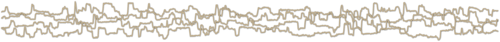

# Performance of neural network basecalling tools for Oxford Nanopore sequencing

__Ryan R. Wick1, Louise M. Judd1 and Kathryn E. Holt1,2__
 
1. Department of Infectious Diseases, Central Clinical School, Monash University, Melbourne, Victoria 3004, Australia 2. London School of Hygiene & Tropical Medicine, London WC1E 7HT, UK

This repository contains the scripts used in the preparation of our manuscript on basecalling performance: 
[Wick RR, Judd LM, Holt KE. Performance of neural network basecalling tools for Oxford Nanopore sequencing. Genome Biology. 2019;20(1):129.](https://genomebiology.biomedcentral.com/articles/10.1186/s13059-019-1727-y)

In August 2019, I put a small addendum to this paper on GitHub which looks at a more recent version of Guppy as well as some different polishing strategies: 
[github.com/rrwick/August-2019-consensus-accuracy-update](https://github.com/rrwick/August-2019-consensus-accuracy-update)

Previous versions of this repository contained the analysis results here in the README, but the current results are now in that manuscript and this repo just holds the scripts associated with the analysis. These scripts assume you're running on Ubuntu 16.04. They make work on other OSs, but no guarantees!

If you're still interested in the older results, here is a link to the earlier version of this repo: [Comparison of Oxford Nanopore basecalling tools](https://github.com/rrwick/Basecalling-comparison/tree/95bf07476f61cda79e6971f20f48c6ac83e634b3).

## Basecalling

Before you analyse a read set, you must generate the read set! The [`basecalling_scripts`](basecalling_scripts) directory contains Bash scripts with the loops/commands I used to run the various basecallers. You'll need to edit the paths at the top of these scripts before running them.

## Custom training of basecallers

The [`sloika_training_scripts`](sloika_training_scripts) directory contains the commands we used to train the custom-_Kp_ and custom-_Kp_-big-net models using [our fork of Sloika](https://github.com/rrwick/sloika).

We used many different isolates in our training set, so the `per-isolate_commands.sh` script contains the commands which must be run separately for each of them.

After the prepartory work is done, the model can be trained with the commands in `training_commands.sh`.

## Read set analysis

The [`analysis_scripts`](analysis_scripts) directory contains the scripts for processing and generating accuracy measurements from read sets. Before the analysis, the reads must be given consistent names, as different basecallers have different conventions for the fastq headers. The `fix_read_names.py` script will convert a read fastq into a format suitable for the next step.

[`analysis.sh`](scripts/analysis.sh) is the 'master script' that will run all analyses on a given read set: read-level accuracy, assembly, assembly-level accuracy, nanopolish and nanopolish-level accuracy. It will use the other scripts in its execution. You also might want to edit some of the variables at the start of the script to change things like the output directories and the number of CPU threads. You can also comment out parts of this script if you only want to run some of the analyses.

## License

[GNU General Public License, version 3](https://www.gnu.org/licenses/gpl-3.0.html)
